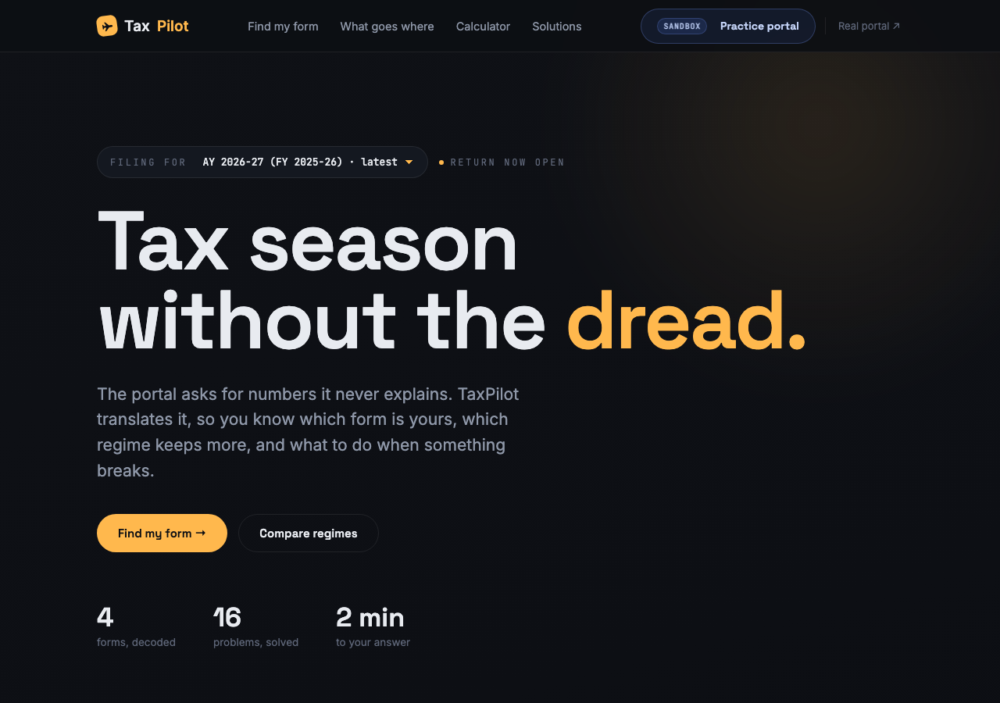
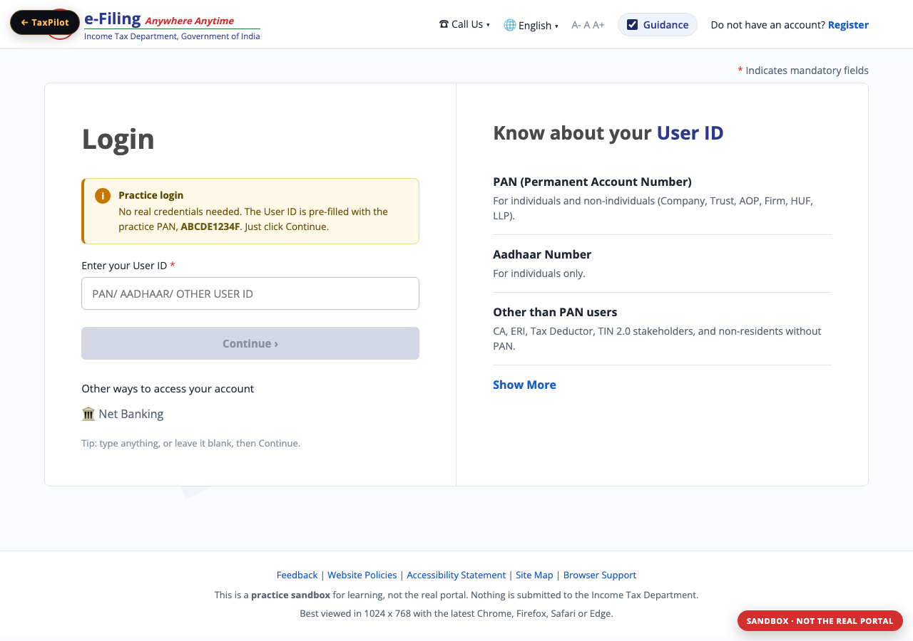

# TaxPilot

**Your co-pilot for filing ITR.**

TaxPilot is a single-page React app that helps first-time Indian income-tax filers understand the e-filing portal — without drowning in jargon. Pick your ITR form, see where each document number goes, compare old vs new tax regime, and look up fixes for the problems people actually hit.

> **Not tax advice.** Figures reflect AY 2026-27 (FY 2025-26). Always verify against your own Form 16, 26AS, and AIS before filing.

---

## Screenshots

### Home

Landing page with assessment-year picker, skim-friendly feature grid, and a link to the official e-Filing portal.



### Find my form

Side-by-side breakdown of ITR-1 through ITR-4: who each form fits, income limits, what rules you out, and which documents you need.


### What goes where

Document-to-schedule mapping: where numbers from Form 16, 26AS, bank certificates, and broker statements land in your return.


### Calculator

Old vs new regime comparison with slab-by-slab breakdown, standard deduction, rebates, and marginal relief for FY 2025-26.


### Solutions

Searchable library of common filing problems — refunds stuck, TDS mismatches, defective notices, verification failures — each with a plain-language fix.


### Practice portal

Sandbox that mirrors the e-Filing flow — fake login, ITR wizard, editable schedules, and live return totals. Nothing is submitted.



---

## Features

| Section | What it does |
|---------|----------------|
| **Home** | Year picker (last 5 AYs), entry points into every tool, link to the official e-Filing portal |
| **Find my form** | ITR-1 / 2 / 3 / 4 explainer with fit criteria, disqualifiers, and per-form document checklist |
| **What goes where** | Maps source documents (Form 16, 26AS, AIS, broker statements) to the exact ITR schedule fields |
| **Calculator** | Computes tax under old and new regime with slab detail, 87A rebate, and marginal relief |
| **Solutions** | Searchable, filterable Q&A for refunds, payments, mismatches, notices, forms, verification, regimes, deadlines |
| **Practice portal** | Full mock e-Filing sandbox with coach marks, editable schedules, and live totals — no real submission |

---

## Tech stack

- **React 19** — UI and client-side state
- **Vite 6** — dev server and production build
- **No backend** — all data is static constants in `src/TaxPilot.jsx`
- **No UI library** — custom dark theme with inline styles and a single `<style>` block

---

## Getting started

### Prerequisites

- [Node.js](https://nodejs.org/) 18 or later
- npm (comes with Node)

### Install and run

```bash
git clone <repo-url>
cd TaxPilot
npm install
npm run dev
```

Open **http://localhost:5173** in your browser.

### Other scripts

| Command | Description |
|---------|-------------|
| `npm run dev` | Start Vite dev server with hot reload |
| `npm run build` | Production build to `dist/` |
| `npm run preview` | Serve the production build locally |
| `npm run screenshots` | Regenerate README screenshots (dev server must be running) |

---

## Project structure

```
TaxPilot/
├── public/
│   └── favicon.svg          # Amber plane icon (matches nav logo)
├── docs/
│   └── screenshots/         # App screenshots for README
├── scripts/
│   └── capture-screenshots.mjs
├── src/
│   ├── main.jsx             # Entry point — mounts <App /> into #root
│   ├── TaxPilot.jsx         # Main app: data, tax engine, all views
│   └── PracticePortal.jsx   # Mock e-Filing sandbox
├── index.html               # HTML shell + favicon link
├── vite.config.js
└── package.json
```

### How it runs

1. `index.html` loads `src/main.jsx`
2. `main.jsx` calls `createRoot(...).render(<App />)`
3. `TaxPilot.jsx` exports `App`, which holds view state (`home`, `finder`, `mapping`, `calc`, `solutions`, `practice`) and renders the active section

---

## Regenerating screenshots

Screenshots are captured with Playwright at **1280×900 viewport** (above-the-fold only — not full-page scrolls). Chromium installs on first `npm install` via the `playwright` dev dependency.

```bash
# Terminal 1 — keep the dev server running
npm run dev

# Terminal 2 — capture all six views
npm run screenshots
```

Output lands in `docs/screenshots/`. Commit the updated PNGs alongside any UI changes.

---

## Disclaimer

TaxPilot is a **learning companion**, not a substitute for a chartered accountant or the official Income Tax Department portal. Tax law changes; portal behaviour changes. Use this to understand *what* the portal is asking and *why*, then file on [eportal.incometax.gov.in](https://eportal.incometax.gov.in) with your own verified numbers.
